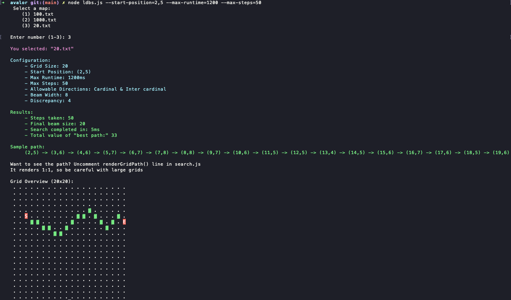
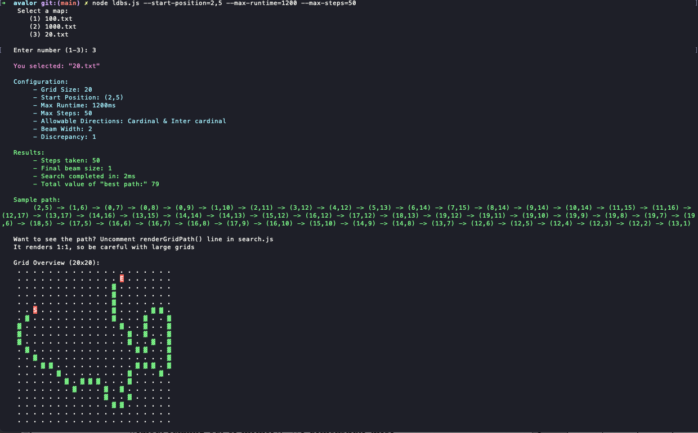

# Avalor Assignment

> [Assignment Brief](./SE_assessment_1_pathplanner_short.md)

## General thoughts
- This was relatively challenging and outside of my comfort zone; I've never done pathfinding.
- It took me a couple hours or reading to figure out how best to approach this.
- I decided to develop this more as a "program" rather than as a straight algo, so you'll have to give me some liberty there.

## Algo approach
- Like I said, I'm relatively unfamiliar with this kind of work. At a glance, it's apparent that it's a 2D array traversal problem.
- Knowing that, there are a couple common ways to execute this:
    - BFS / DFS (memory go 💥)
    - Beam Search (very greedy)
    - Limited discrepancy beam search (LDBS; good balance between exploration and greediness)
- I read up on some of these approaches and selected LDBS as it seemed the most likely candidate; efficient with large sets (grids), and "good enough" when it comes to finding an optimal-enough path.
    - Source: [`Limited Discrepancy Beam Search by David Furcy & Sven Koenig`](https://www.ijcai.org/Proceedings/05/Papers/0596.pdf)

### LDBS params
#### Discrepancy
- How far we're willing to travel from the optimal node at each step
- For example, with a discrepancy of `4`, we keep the top child `[0]` plus up to 4 alternative ("worse") children `[1–4]`.
    - Since children are sorted by score (highest value first; descending), index `0` is the best choice. Subsequent indices represent progressively worse paths.
- Since we're keeping a handful of worse paths, this allows the algo to backtrack if the greedy path fails

#### Beam Width
- This value denotes how many paths we should keep; the maximum number of paths to explore
- A value of `8` matches all cardinal & inter cardinal directions
- lowering this number will narrow the number of nodes to explore, increasing the speed at the risk of finding a worse path.

## Structural approach
- The program takes a number of arguments at runtime. From there, the "map selection" (grid) is handled with a user prompt.
- Separation of concerns:
    - `ldbs.js` - main entry point; handles configuration and user input
    - `src/search.js` does the heavy lifting and returns the result
    - `src/config.js` holds some global configuration values used in various places within the program. You can adjust the beam width, discrepancy, directions, delimiter, and other things in this file.
    - `src/renderPath.js` this is some fun; it renders the chosen (most valuable) path

## Running the program
### Prereqs
- The program is written in JavaScript; you must have NodeJS installed.
    - [https://nodejs.org/en/download](https://nodejs.org/en/download)
- The program has no dependencies; it only uses internal libraries available within NodeJS; there is no need to install anything else.
- You shouldn't need to make it executable, but in case you do run this command from the root of the project:
    - `chmod +x ldbs.js`

### Running it
- from the root directory of the project, execute:
    ```
    $ node ldbs.js --start-position=YOUR_X,YOUR_Y --max-runtime=YOUR_TIME(ms) --max-steps=YOUR_STEPS

    Example:
    $ node ldbs.js --start-position=2,5 --max-runtime=500 --max-steps=1000
    ```
- There's no need to specify the grid size, as the program will prompt you to select a file (grid size). It'll read any grid so long as it's in the `grids/` directory

## Results

- You can get interesting results by tweaking the `beamWidth` (make it narrower) and `maxDiscrepancy` (make it smaller) in `src/config.js` while retaining a high maximum step count or timeout.
    - default:
        - `beamWidth`: 8
        - `maxDiscrepancy`: 4
        - command: `node ldbs.js --start-position=2,5 --max-runtime=1200 --max-steps=50`
        
    - "more exploration;" worse path, but faster
        - `beamWidth`: 2
        - `maxDiscrepancy`: 1
        - command: `node ldbs.js --start-position=2,5 --max-runtime=1200 --max-steps=50`
        

### Output
After a run, you'll receive your score:
```bash
➜  avalor git:(main) ✗ node ldbs.js --start-position=2,5 --max-runtime=1200 --max-steps=50
    Select a map:
       (1) 100.txt
       (2) 1000.txt
       (3) 20.txt

   Enter number (1-3): 3
 
   You selected: "20.txt"

   Configuration:
        - Grid Size: 20
        - Start Position: (2,5)
        - Max Runtime: 1200ms
        - Max Steps: 50
        - Allowable Directions: Cardinal & Inter cardinal
        - Beam Width: 8
        - Discrepancy: 4
    
   Results:
        - Steps taken: 50
        - Number of available paths: 20
        - Search completed in: 5ms
        - Total value of "best path:" 33
    
   Best path:
        (2,5) -> (3,6) -> (4,6) -> (5,7) -> (6,7) -> (7,8) -> (8,8) -> (9,7) -> (10,6) -> (11,5) -> (12,5) -> (13,4) -> (14,5) -> (15,6) -> (16,7) -> (17,6) -> (18,5) -> (19,6)
```


#### Visualize Path
If you wish to visualize the chosen path you can set `shouldRenderGraph` to `true` in `src/config.js`

This will output a 1:1 scale graph of the best path, like so:
```bash
   Grid Overview (20x20):
    . . . . . . . . . . . . . . . . . . . . 
    . . . . . . . . . . . . . . . . . . . . 
    . . . . . . . . . . . . . . . . . . . . 
    . . . . . . . . . . . . . . . . . . . . 
    . . . . . . . . . . . . . ▓ . . . . . . 
    . . S . . . . . . . . ▓ ▓ . ▓ . . . ▓ . 
    . . . ▓ ▓ . . . . . ▓ . . . . ▓ . ▓ . E 
    . . . . . ▓ ▓ . . ▓ . . . . . . ▓ . . . 
    . . . . . . . ▓ ▓ . . . . . . . . . . . 
    . . . . . . . . . . . . . . . . . . . . 
    . . . . . . . . . . . . . . . . . . . . 
    . . . . . . . . . . . . . . . . . . . . 
    . . . . . . . . . . . . . . . . . . . . 
    . . . . . . . . . . . . . . . . . . . . 
    . . . . . . . . . . . . . . . . . . . . 
    . . . . . . . . . . . . . . . . . . . . 
    . . . . . . . . . . . . . . . . . . . . 
    . . . . . . . . . . . . . . . . . . . . 
    . . . . . . . . . . . . . . . . . . . . 
    . . . . . . . . . . . . . . . . . . . . 
```

## Caveats
- No tests
- I didn't understand the requirement that asks to build a relationship between the algo, marking visited nodes (mutating their state in memory), and mutating their state again over time (incrementing); should the algo have kept running while we're modifying the map in memory until time runs out?
